import Adsense from "../src/components/Adsense";
import TOCInline from "@theme/TOCInline";


Discord Rich Presence 是一個可以顯示你目前狀態更多資訊的東西，可以看到朋友都能顯示他在玩什麼遊戲、正在用什麼程式語言和 IDE 寫程式。此文章會教大家設定 Discord 豐富狀態（Rich Presence）的多種方法，讓你的朋友或伺服器成員更知道您現在在做什麼！

<TOCInline toc={toc}/>

<!--truncate-->
原本真的找不到什麼主題好寫的，但想到最近有人在問Discord Rich Presence，我就想......寫這篇文章吧！我也覺得我到目前對Yeecord真的貢獻還是太少了，現在也沒有什麼很critical的可以貢獻，就寫文章來貢獻Yeecord吧！或許也幫助那些Discord Rich Presence不會搞的人......

:::info
此文章會提及多種設定方法，請挑一個適合自己或者自己喜歡的方法就好，不用挑自己不喜歡或者自己覺得有夠難的方法折磨自己~~（當然如果你打死就是要這樣折磨自己我也是沒意見，反正我也勸了，請不要折磨自己後還跑來伺服器哭哭啼啼說這方法好不舒服、感覺好自虐......，誰叫你不聽勸，你不聽勸我真的也沒輒）~~
:::
## 方法一：開啟軟體
開啟軟體......作者你認真的嗎？我軟體都開了怎麼還是沒有咧？？？
當然認真的！有些軟體作者其實有把設定Discord Rich Presence程式碼寫進去他的軟體，你一開啟軟體就有了！或者沒有的話你進行一些設定就有了！
比如Minecraft：

但如果那個軟體作者沒有把設定Discord Rich Presence的程式碼寫在軟體裡面呢？沒關係，先繼續看下去囉～～
## 方法二：使用插件
當然也有些軟體是沒有寫入Discord Rich Presence程式碼的，但是有人有提供插件讓您可以安裝，讓您方便進行設定！
以下舉一些軟體的插件講解：
### Visual Studio Code
Visual Studio Code是一款微軟開發的一款非常好用的一款編輯器，除了Git、Debug功能外，還有非常大的主題與延伸模組庫，連Discord Rich Presence都有非常多的延伸模組！以下就為各位介紹如何安裝與設定：

首先，請先前往延伸模組商店，並在搜尋中輸入「Discord Rich Presence」，它會列出相關延伸模組，找到自己喜歡的模組後，請按下安裝按鈕進行安裝 （在此我安裝這張圖中的第二個）


安裝完後，在Discord就能看到Rich Presence了


狀態部分，Idling的話代表沒有在編輯檔案，有開啟檔案的話會顯示正在編輯的檔案，並且滑鼠移到大圖示上會顯示正在編輯什麼類型的檔案，移到大圖示右下角的小圖示也會顯示目前使用的軟體
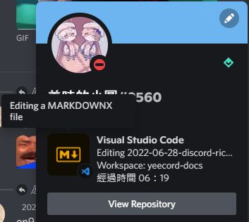

### Intellij IDEA等其他JetBrains軟體
Intellij IDEA的話是由JetBrains公司開發的一款整合式開發環境，社區版跟Visual Studio Code一樣有Git、Debug等功能，但只支援Java、Kotlin等少數程式語言。但升級至高級版後不但有內建社區版功能，還有內建DataBase Reader、遠端開發等超強功能，~~順帶一提，凱恩就是這款軟體的愛用者喔～～~~
回到插件，不只Intellij IDEA，JetBrains軟體也都有插件功能，並且也早就有人寫好Discord Rich Presence插件了，下方就教大家如何安裝～～

#### 安裝插件
首先請按下鍵盤上的``Ctrl``+``Shift``+``S``開啟設定視窗，並點選左側``Plugins``前往插件管理頁面  


:::info NOTE
在沒有開啟專案的情況下，請在左側選單直接點選``Plugins``開啟插件管理頁面  
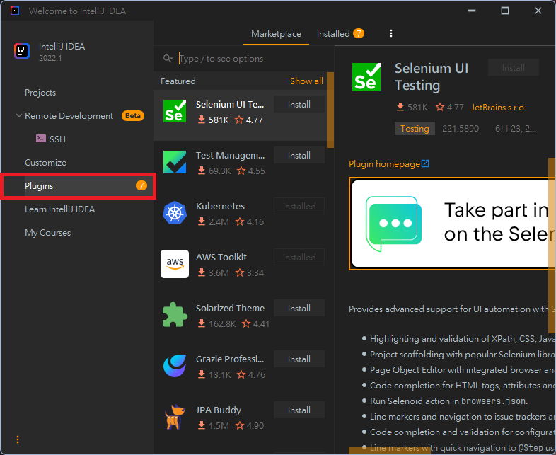
:::

再來，請在上方搜尋``Discord Integration``，找到這個插件並按下插件名稱旁的``Install``按鈕進行安裝  
安裝成功後會顯示``Restart IDE``，點選該按鈕將IDE重新啟動。  


#### 使用設定
狀態顯示部分，請按下鍵盤上的``Ctrl``+``Shift``+``S``開啟設定視窗，並在左邊選單選擇``Discord``，即可看到Rich Presence顯示設定，通常保留預設值即可。


:::info
這裡就先不詳細說每個設定欄位了，如果真的要設定的話可以自己先切換不同狀態的設定自己先摸索一下，有些欄位等一下文章後面會介紹Discord官方的Rich Presence Visualizer工具，也會讓您知道那些欄位是對應到什麼  
總共有三個狀態可以設定：
* Application：開啟IDE時會套用此設定
* Project：在有開啟專案但沒開啟檔案時，會套用此設定
* File：在有開啟檔案時，會套用此設定
:::
專案設定部分的話，您可以在此設定專案的狀態顯示方式


## 方法三：使用別人寫好的軟體
如果該軟體開發者沒有將Rich Presence程式碼寫進去軟體，而且它也沒有提供插件，您可以使用此方法，並且不用寫任何的程式碼。  
:::info
網路上的確有蠻多的Discord Rich Presence軟體，但在此會用CustomRP這款軟體進行演示，如果您想使用其他軟體（例如：``EasyRP``），請自行參考該軟體作者寫的使用說明。
:::
### 事前準備與上傳圖片
首先，請先創建一個應用程式
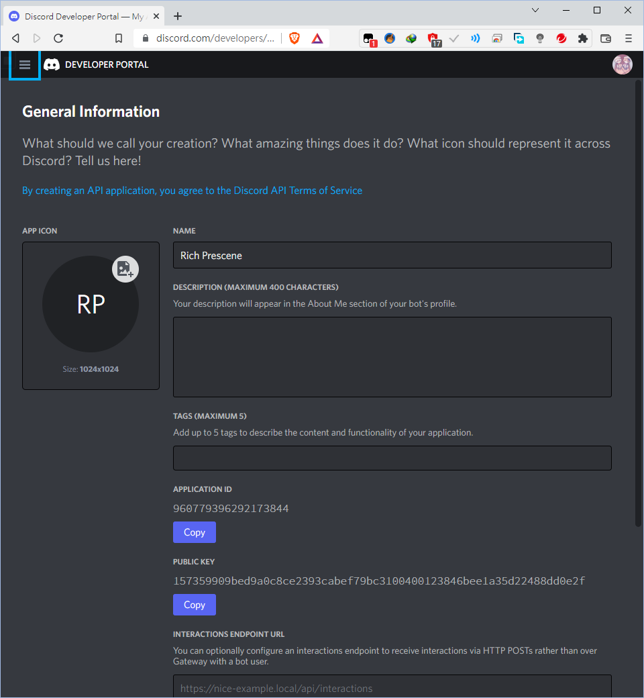  
:::info NOTE
如果您還不知道怎麼創建一個應用程式，請閱讀[「猴子都能懂的Discord教學」文章的「註冊應用程式」](https://yeecord.com/blog/make-discord-music-bot-without-coding/#1-%E8%A8%BB%E5%86%8A%E6%87%89%E7%94%A8%E7%A8%8B%E5%BC%8F)
:::
再來，請進入您剛剛創建的應用程式，並在左側選擇`Rich Presence` -> `Art Assets`，此時您會看到右側會有兩個區塊。``Rich Presence Assets``就是讓您上傳等一下Rich Presence上要顯示的圖片之區域，按下``Add image(s)``即可添加圖片
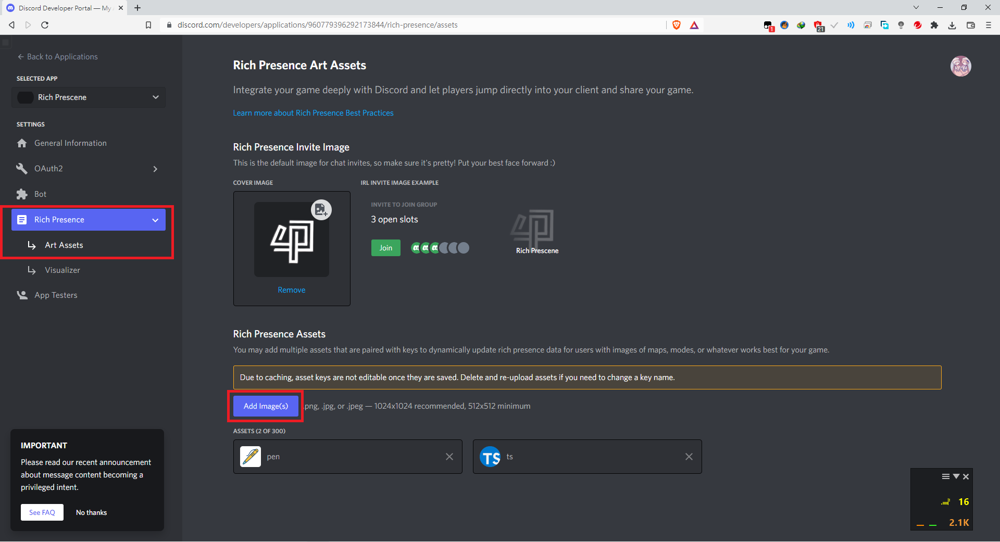

:::caution
Rich Presence Assets上傳的圖片限制為：格式為``.png``、``.jpg``或``.jpeg``，建議圖片尺寸為``1024*1024``，最小圖片尺寸為``512*512``
:::
### 下載軟體
請先前往[CustomRP軟體官網](https://www.customrp.xyz/)點選``Installer``下載安裝版或``Portable``下載免安裝版（在此下載免安裝版）：  
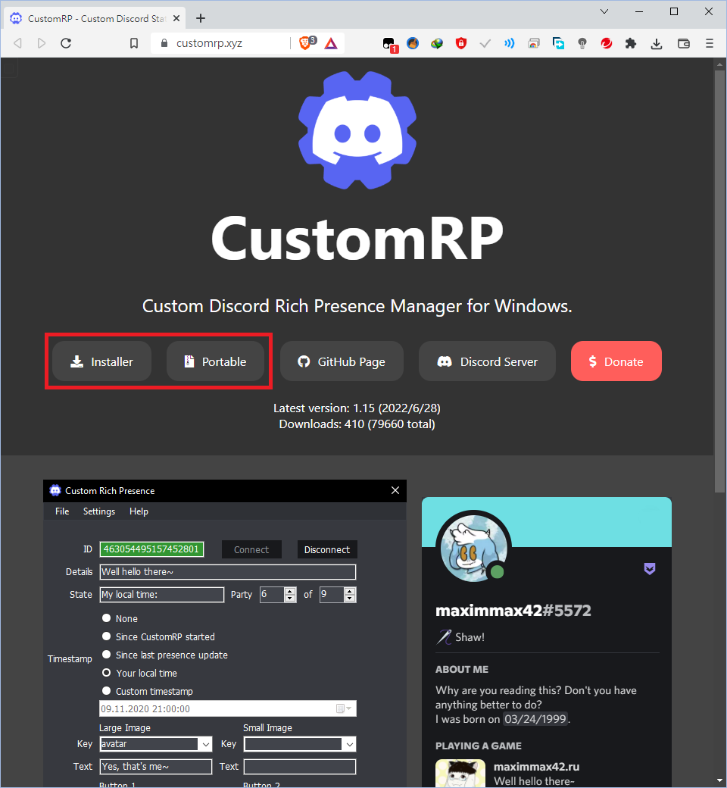
:::info NOTE
這個軟體其實在安裝時不用管理員權限，所以如果沒有系統管理員權限的話也不用擔心的，您還是可以下載安裝檔進行安裝。
:::
下載後，請將下載到的壓縮檔解壓縮。  
解壓縮完成後請進入剛剛解壓出來的資料夾，點選``CustomRP.exe``開啟軟體  
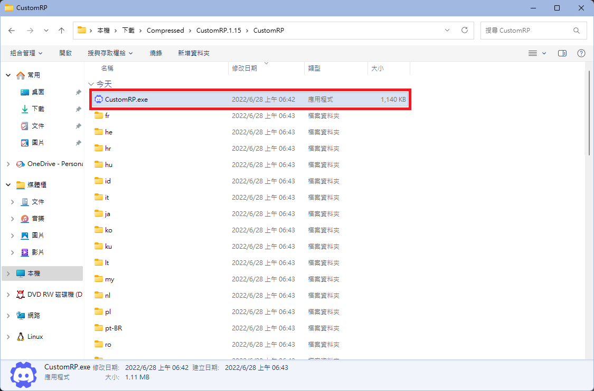
:::info NOTE
若您剛剛下載安裝檔，請雙擊剛剛下載下來的安裝檔，依照安裝步驟進行安裝，然後在安裝完後開啟軟體  

:::
第一次啟動時，他會問您是否將使用情況分析提供給開發人員，這個......請自己決定  
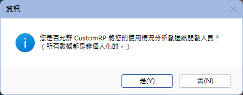  
之後就會看到軟體主介面了！  

### 填入資訊
首先是ID，請先前往剛才的應用程式設定，將Application ID複製，並貼入CustomRP的ID欄位：
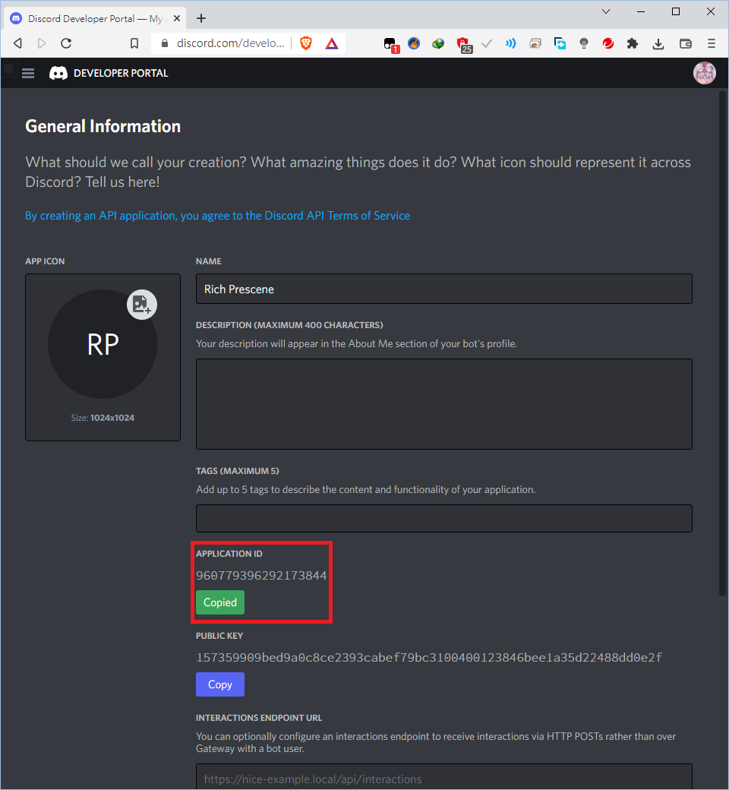  
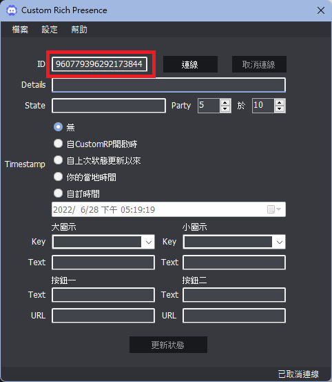  
填完後，我們先按一下ID欄位旁的連線進行連線先確認ID是否正確。
如果ID欄位的底色變成綠色，恭喜您，它已經成功連線並將您的狀態設置成功了！  


接下來就是其他資訊了，首先請回到剛剛的應用程式設定，然後點選左方的``Rich Presence`` -> ``Visualizer``  
在這你就可以看到Rich Presence展示器，您可以在此填好各項資訊並確認顯示出來沒問題後，再到CustomCP進行貼上的動作  
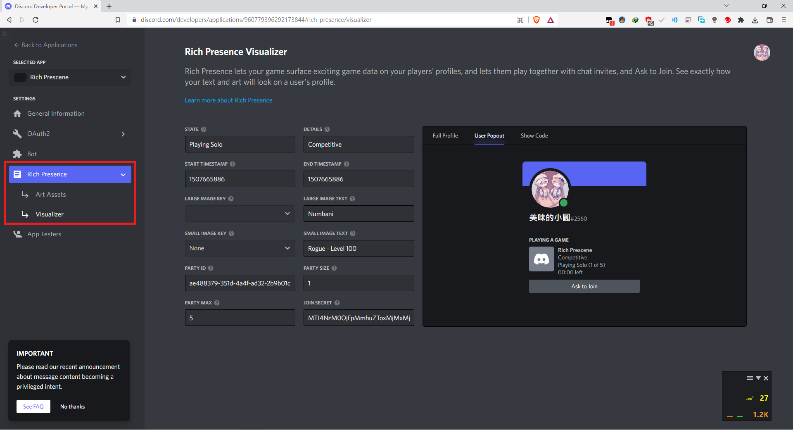
:::info 欄位介紹（此僅列出要填入CustomRP的）
* ``State``：目前狀態
* ``Details``：目前正在做什麼
* ``Start TimeStamp`` / ``End TimeStamp``：什麼時候開始 / 結束的，填入值為從1970年1月1號到現在的秒數，此兩欄位皆可以不用理會，直接在CustomRP上設定即可
* ``Large Image Key`` / ``Small Image Key``：大 / 小圖示名稱，此值會決定大 / 小圖示是哪一張，如果不知道哪個Image Key對應哪張圖，可前往``Art Assets``查看。（小圖示會顯示在大圖示的右下角）
* ``Large Image Text`` / ``Small Image Text``：當滑鼠移到大 / 小圖示上時，要顯示什麼字串
:::

填好之後，再次按下連線或者更新狀態按鈕（如果剛剛沒有按取消連線），就可以看到狀態成功顯示了！  
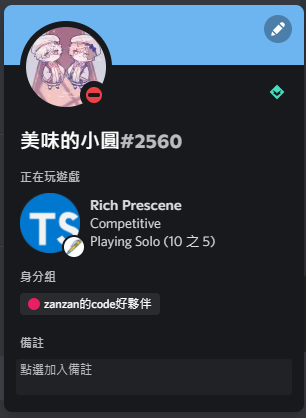

:::info CustomRP視窗下方的按鈕設定是什麼？
就是讓你的自訂義狀態能顯示按鈕，並且能設定按了以後能連至什麼網站。``Text``是按鈕會顯示的文字，``URL``則是按下按鈕後會連至什麼網站    
效果展示：  
  
（注意：在電腦或網頁板Discord中，自己按按鈕是不會有事情發生的）
:::

## 方法四：撰寫程式碼
當然，現在一定也有很多程式開發者寫出Discord Rich Presence打包了，想藉此體驗也程式快感的也可以喔！

:::caution
* 此方法會牽涉到多種程式語言的程式碼撰寫！在此也順便提醒，在這裡可以挑自己喜歡的程式語言就可以了，不用每一個都嘗試！也請各位量力而為，理解到不舒服時請立即停止！
* 如果您真的很想知道程式碼每個字是什麼意義，請自行上網Google了解物件導向、程式語言的相關知識！或者不知道該程式語言開發環境怎麼安裝的，也請自行Google！
* 在此也會省略創建應用程式與欄位介紹，如果不知道哪個欄位是什麼意義、要怎麼填的，請先閱讀上方方法三！
:::

### Python
簡單易學的程式語言為什麼不要提呢？  
不只程式語言易理解，連模組很多也做得非常易用，在此就用Python和PyPresence模組來教大家如何用Python來設定Rich Presence。

#### 安裝模組與建立檔案
首先請先開一個終端機，輸入以下指令安裝模組：
```shell
pip install pypresence
```

安裝完成後，請在您覺得適合的地方建立一個Python檔案  

#### 開始撰寫程式碼
首先我們要先匯入等一下需要用的模組
```py showLineNumbers
from pypresence import Presence #Presence客戶端
import time                     #等一下這也會用到
```

:::info 解析
因為在這裡只有要用到PyPresence模組的Presence類別，所以使用此語法只匯入Presence類別
:::

再來，創建Presence客戶端實體（用以連線並設定Rich Presence）：
```python showLineNumbers
presenceClient = Presence(client_id = "clientID")
```

:::caution
上方``clientID``請替換成自己的Application ID！
:::

接下來，讓該實體進行連線：
```python showLineNumbers
client.connect()
```

然後，更新Rich Presence
```python showLineNumbers
client.update(state = "RPCTest") #更新Rich Presence
print("更改狀態成功！")
```

:::info 解析
* 為了讓我們知道已經好了，所以加了一行印出字串讓我們知道好了
* 在此只示範更改state欄位，如果想更改更多欄位，請參考[PyPresence Docs](https://qwertyquerty.github.io/pypresence/html/doc/presence.html?highlight=update#update)
:::

最後寫一個迴圈來避免程式結束
```python showLineNumbers
while True:
    time.sleep(15)
```

執行程式碼！（執行結果在此圖最下方）   
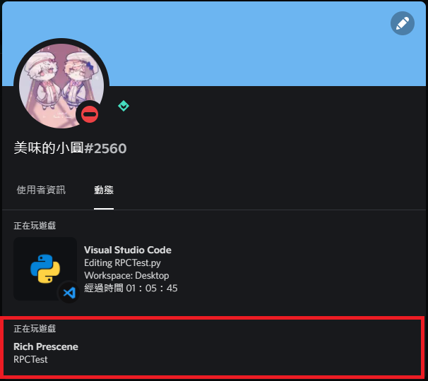

### JavaScript / TypeScript
不知道會不會有人心裡有個懷疑......JavaScript不是用在前端上嗎?  
其實到了這時代已經沒有了這回事，Node.js已經成功讓其擁有後端（伺服器端）執行能力，而且也有非常強大的套件庫，您想要的套件也應有盡有，所以也非常多程式設計師非常喜歡使用JavaScript！  
那TypeScript和JavaScript的關係又是什麼呢？TypeScript其實是一個JavaScript的超集合程式語言，不只涵蓋JavaScript所有語法，還有型別系統、更多一般物件導向的元素（例如：介面）等非常多東西！TypeScript除了功能更強，也能避免我們犯一些小錯誤！

以下就用JavaScript / TypeScript + discord-rpc模組來教一下各位怎麼寫吧！
#### 建立專案與安裝模組
請先建立專案並安裝discord-rpc模組  
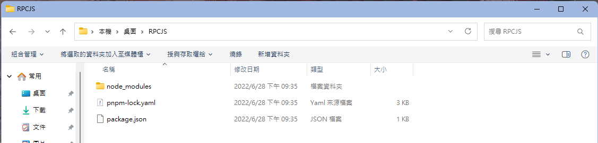  
:::caution
如果您不知道如何建立專案或安裝模組，請參考[使用 discord.js 快速建立一個 Discord 骰子機器人](https://yeecord.com/blog/discordjs-dice-bot/)，在此因為篇幅關係，所以我就不講解了
:::
#### 開始撰寫程式碼
請先在專案資料夾中建立``index.js``  
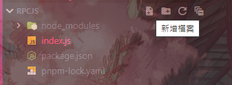

:::info NOTE
如果您想要使用TypeScript，請建立``index.ts``
:::

接下來就開始撰寫程式碼吧！  
首先我們得先匯入Rich Presence客戶端，並且產生一個實體
```javascript showLineNumbers
const { Client } = require("discord-rpc");
  
const rpcClient = new Client({ transport: "ipc" });
```

:::info NOTE
如果您是TypeScript，第一行請寫
```typescript showLineNumbers
import { Client } from "discord-rpc";
```
:::  
再來，寫一個ready監聽器
```javascript showLineNumbers
rpcClient.on("ready",() => {
    rpcClient.setActivity({
        state: "JS RPC Test",
        details: "This is just a JS RPC test",
        buttons: [
            {
                label: "test",
                url: "https://www.google.com"
            }
        ]
    })
    console.log("Activity Changed!")
})
```

:::info 程式碼解析
* 當RPC客戶端成功上線後，會觸發此監聽器，並執行指定程式碼（在此是執行箭頭函式裡面的程式碼）
* 以此程式碼為例，當RPC客戶端成功上線後，會將您的Rich Presence修改成您指定的資訊，並印出指令訊息讓我們知道Rich Presence已設定完成。
* 在此只示範更改一些欄位，如果想更改更多欄位，請參考其他的教學影片（我也不知道為什麼discord-rpc的docs不見了）
:::

最後，再讓RPC客戶端連線
```javascript showLineNumbers
rpcClient.login({clientId: "clientID"})
```

:::caution
上方``clientID``請替換成自己的Application ID！
:::

執行程式！（執行成果一樣圖片中間偏下處）  


### C#

C#是一個由C和C++衍生出來的物件導向程式語言，不僅消除了一些C和C++一些複雜的特性，也繼承了C和C++程式語言的強大功能。並且C#也擁有非常強大的套件庫NuGet，裡面模組也是琳瑯滿目。  
有些人或許會覺得：C#架構跟Java一樣，剛開始就會看到Class，跟一些其他程式語言相比，不太平易近人......  
但其實到了.NET 6.0後，當你建立一個專案時，你會發現它架構會跟JavaScript / TypeScript一樣，沒錯，在你沒特別動手把主檔案搞成NET 5.0架構的狀況下，程式會跟JavaScript一樣直接從第一行開始執行，並且支援外層`await`，根本比JavaScript還要強不知道多少倍！

說了那麼多......以下就用C# + 來教一下各位怎麼寫吧！  
:::info
以下程式碼會以.NET 7.0進行撰寫，.NET 5.0以下的話......我有空會再寫
:::

#### 建立專案與安裝模組
在此會先以JetBrains Rider來示範，請先點選右上角的New Solution創建專案  
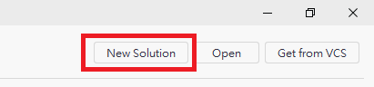  
點選後會出現此視窗，左邊請選擇``Console Application``，右邊請將``Solution Name``修改成您想要的專案名稱，確認下方SDK為7.0、Language為C#、Framwork為net7.0以後，按下右下角``Create``按鈕創建專案  
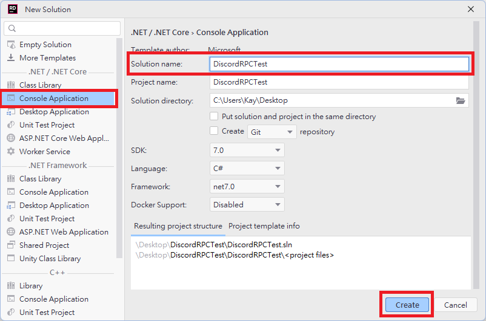

建立完成以後，Rider會自動幫你開啟`Program.cs`，此時請先別急，請先在視窗底部找到``NuGet``並點一下，此時會開啟NuGet模組管理，並在左上搜尋欄位中輸入`DiscordRichPresence`  
  
它會找到一個模組，點擊後右邊會顯示指令資訊，請點選``nuget.org``選單旁的``+``進行安裝  
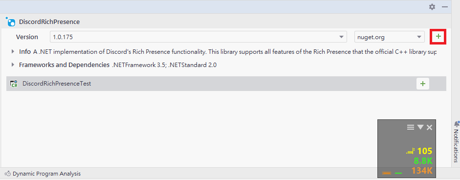

#### 開始撰寫程式碼
請先將裡面所有內容刪除，並匯入模組
```csharp showLineNumbers
using DiscordRPC;
using DiscordRPC.Logging;
``` 

再來，創建Discord Rich Presence客戶端實體與記錄產生器
```csharp showLineNumbers
DiscordRpcClient client = new DiscordRpcClient("960779396292173844");
client.Logger = new ConsoleLogger { Level = LogLevel.Warning };
``` 

:::info 解析
* ``ConsoleLogger``類別因為建構元沒有參數，所以小括號可以省略。
* ``ConsoleLogger``該行最後方是[物件初始設定式](https://docs.microsoft.com/zh-tw/dotnet/csharp/programming-guide/classes-and-structs/how-to-initialize-objects-by-using-an-object-initializer)，讓您可以在創建實體時，同時初始化指定公有屬性（注意！私有屬性無法透過物件初始設定式設值！）
:::

接下來，再寫一個ready監聽器
```csharp showLineNumbers
client.OnReady += (sender, eventArgs) =>  //Ready監聽器
{
    Console.WriteLine("RichPresence Client is ready");
};
``` 

:::info
上面的``+=``是[委派](https://docs.microsoft.com/zh-tw/dotnet/csharp/programming-guide/delegates/using-delegates)的用法，礙於篇幅關係，在這裡就不介紹了。
:::

然後初始化客戶端連線
```csharp showLineNumbers
client.Initialize();
``` 

更新Rich Presence
```csharp showLineNumbers
RichPresence presence = new RichPresence
{
    Details = "DiscordCSharpRichPresenceTest",
    State = "TestState",
    Assets = new Assets
    {
        LargeImageKey = "ts",
        LargeImageText = "Editing TS File",
        SmallImageKey = "pen",
        SmallImageText = "Editing"
    }
};
  
client.SetPresence(presence);
``` 

最後，加上此行使程式不會結束
```csharp showLineNumbers
await Task.Delay(-1);
```

執行成果！  
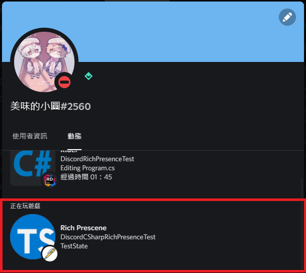